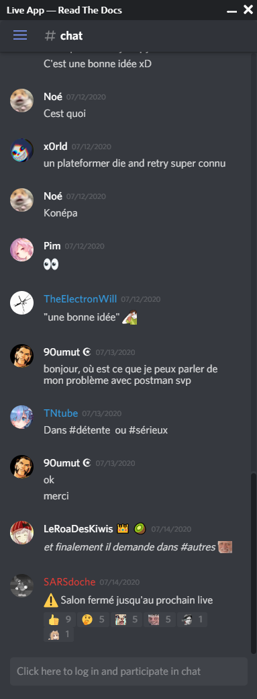

# LiveApp MVP 🔴

This application allows to read the discord chat of some channel, using [WidgetBot](https://widgetbot.io/) while doing other things. \
In other words, it is an *always on top* application, which allows to do some other things like programming a thing in an IntelliJ-based IDE but to see the chat simultaneously.

**The primary purpose of this app is to be used while streaming live, on discord!**

## WARNING!

This application is **heavy**: because of ElectronJS which is basically a full browser, it weighs around 160MB. \
It has originally been made in less than an hour, to get **a quick MVP**.

## How to use

You can download the latest release [here](https://github.com/readthedocs-fr/LiveApp-frontend/releases), unzip it with [7-zip](https://www.7-zip.org/) and run liveapp.exe

## How to build

- Install [volta](https://volta.sh/)
- Go to `src/` folder and install dependencies (`npm install`)
- Run command `npm run build`

You will now found the build into the `src/dist/` folder.

## License

This application is licensed under the [MIT License](LICENSE).

## Credits

- [Some images](src/public/assets/fontawesome5/) from [Font Awesome](https://fontawesome.com). See credits [here](src/public/assets/fontawesome5/README.md).

## Screenshot

